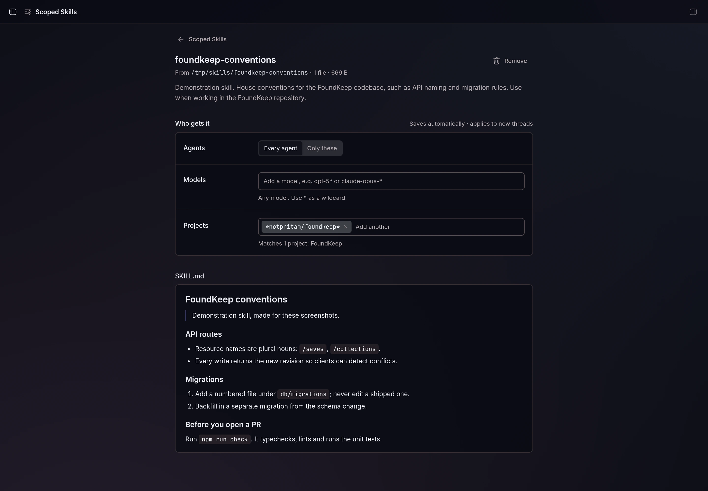
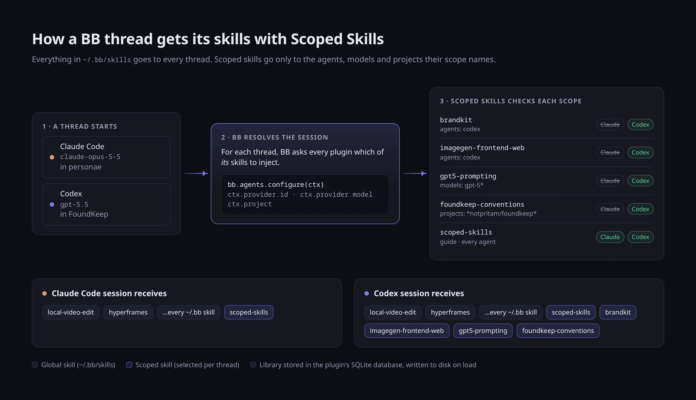

# Scoped Skills

Give each BB skill only to the agents, models and projects that should have it.

BB hands every skill in `~/.bb/skills` to every thread, whatever agent runs it.
That breaks down once your agents differ: an image-generation skill is useless
in Claude Code, which has no image tool, and a prompt tuned for one model can
mislead another. Scoped Skills keeps a library in which every skill carries a
scope, and gives a thread only the skills whose scope matches its agent and
model.


## Install

```sh
bb plugin install git:github.com/notpritam/bb-plugin-scoped-skills@^0.2.0
```

Or add the [notpritam marketplace](https://github.com/notpritam/bb-marketplace)
and install `scoped-skills@notpritam`.

## Use

**Page.** Open **Scoped Skills** in the sidebar. The library lists every
skill with its scope as badges; **Preview** shows which skills a thread on a
given agent, model and project would get. Click a skill to change who gets it
(agents, model globs, project globs with a live "matches N projects" readout)
and read its SKILL.md. **Import skill** copies a skill folder in.



**CLI.**

```sh
bb scoped-skills agents                                   # agent ids: codex, claude-code, …
bb scoped-skills import ~/.claude/skills/brandkit --agents codex
bb scoped-skills scope brandkit --agents codex,claude-code --models 'gpt-5*'
bb scoped-skills scope sync-token --agents all --projects '*emergentbase/*,work'
bb scoped-skills preview --agent claude-code --model claude-opus-5-5 --project mono
bb scoped-skills list
bb scoped-skills remove brandkit
```

**Agents.** Threads get `scoped_skills_list`, `scoped_skills_set_scope` and
`scoped_skills_import`, plus a short `scoped-skills` guide skill, so you can ask
a thread to check or change a scope.

## How it works



```
thread starts ──► BB asks plugins: "agent = codex, model = gpt-5.5 — which skills?"
                     │
                     ▼
        Scoped Skills checks each skill's scope
        brandkit        agents: codex           ✓ included
        gpt-tuning      models: gpt-5*          ✓ included
        claude-only     agents: claude-code     ✗ withheld
                     │
                     ▼
        BB injects only the included skills into the session
```

- The plugin registers `bb.agents.configure`. For each thread, BB passes the
  agent id and model, and the plugin returns the skill names to inject. BB
  injects none of the plugin's other skills.
- The source of truth is the plugin's SQLite database (skills, files and
  scopes). On load and after every change it writes `library/`, a manifest
  skill root, so a plugin update that replaces the plugin folder never loses
  the library.
- Import reads the folder with strict YAML frontmatter parsing, the same rule
  BB applies, so a skill that BB would silently skip is rejected with the
  reason.

## Limits

- Scope changes apply to new sessions. Running sessions keep their skills.
- Copies of the same skill in `~/.bb/skills`, `~/.claude/skills` or
  `~/.codex/skills` still reach every agent. Remove them after importing.
- A thread's model is matched as BB reports it. Use globs (`gpt-5*`) rather
  than exact version strings.
- A project glob matches the project's id, name or git remote URL. A thread
  with no matching project never receives a project-scoped skill.

## Develop

```sh
npm install
npm test          # node --test, uses the SDK's fake plugin host
npm run typecheck
bb plugin build
bb plugin install .
```

## License

MIT
